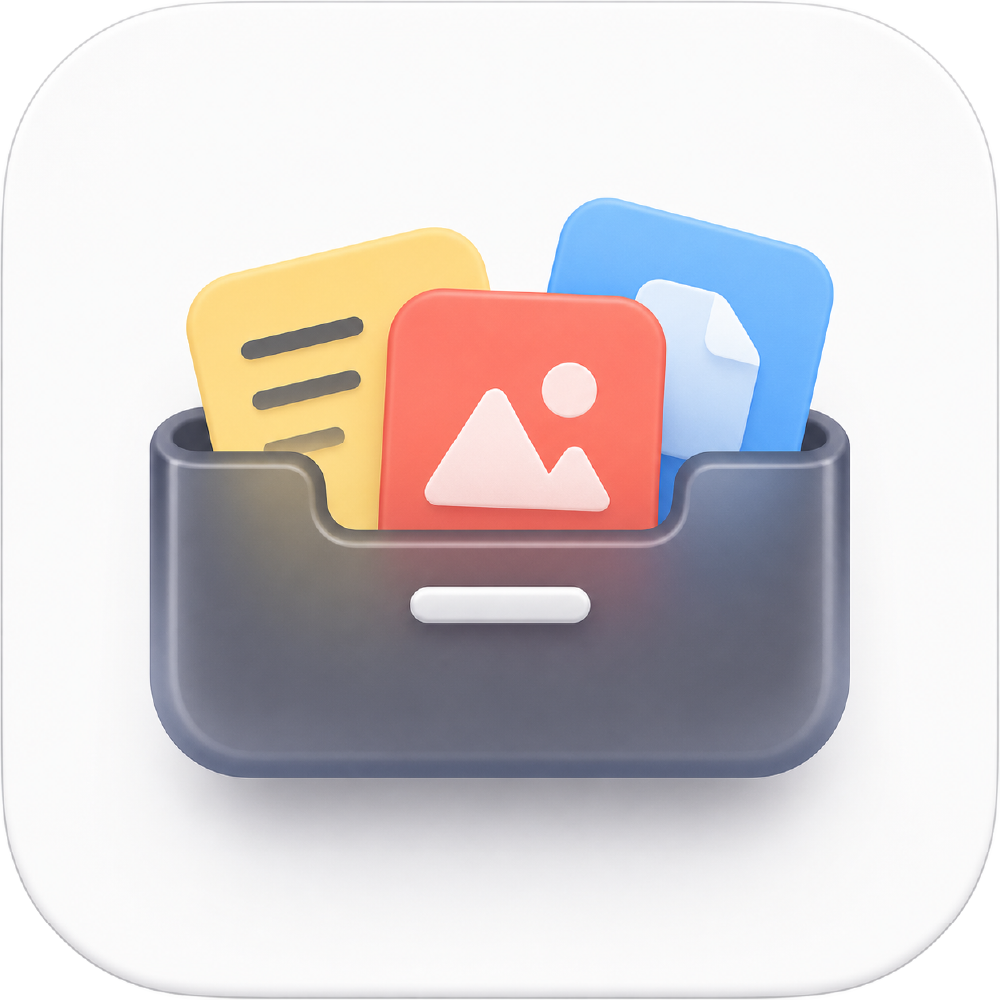

  

<h1 align="center">TT Clip</h1>

<strong>Keep context close.</strong>

  <a href="README.md">English</a> · <a href="README.zh-Hans.md">简体中文</a> · <a href="https://tietie-clipboard.royal-boar-9847.chatgpt.site/">Website</a> · <a href="https://github.com/teeoz/tt-clip/releases">Releases</a>

TT Clip (贴贴剪切板) is a local-first clipboard history app for macOS. It keeps text, code, links, images, and files close to the task at hand—then lets you search, preview, copy again, paste, or drag them into the next app when you need them.

> **Public beta hub**
>
> This repository is the single public home for product information, future signed beta releases, release notes, and feedback. The TT Clip application source is intentionally not published here.

## Why TT Clip

Copying is one of the most frequent actions in modern work—and one of the easiest to interrupt. A sentence, link, image, file, code snippet, or formula you copied moments ago can quickly become hard to find. TT Clip keeps that context within reach, turning **copy → find → use** into one continuous flow.

It is especially useful when moving between chats, browsers, documents, design tools, Finder, and code editors.

## What it helps with

| Work task | TT Clip workflow |
| --- | --- |
| Retrieve something you just copied | Open the edge sidebar and search or browse without leaving the current app. |
| Find older material | Combine keywords with content type, source-app, collection, and time filters in the History Library. |
| Move content between apps | Copy again, use an explicit paste action, or drag supported items into the target app. |
| Work with several items | Select multiple clips, keep their order visible, and control the paste queue. |
| Understand an image, file, link, or long text | Open a focused preview with OCR, metadata, link details, editing, or export where appropriate. |
| Keep current-task material together | Use pinning, favorites, and temporary workspaces without duplicating the original history item. |

## Core capabilities

- **Edge sidebar and shortcuts** — retrieve context quickly, on the left or right side of the screen.
- **Search and organization** — search across text, code, links, images, and files; filter by type, source app, time, pins, favorites, and collections.
- **Native content handling** — preview images, files, links, long text, code, LaTeX, and rich text in focused macOS windows.
- **Local OCR and link tools** — extract image text locally; preserve clear web titles and URLs; generate a local QR code or clean a supported tracking link only when asked.
- **Drag-and-drop bridge** — bring supported Finder content into TT Clip and drag supported history items into another app.
- **Developer-aware retrieval** — code language detection, local formatting for supported Swift content, editor source anchors, and an optional local-only CLI/MCP bridge.
- **Local-first by default** — no account is required; clipboard history stays on the current Mac unless you explicitly copy, export, drag, or share it.

## A typical workflow

1. Copy material in any macOS app; TT Clip captures readable content into local history.
2. Open the sidebar from a shortcut or screen edge.
3. Search, filter, preview, drag, copy, or explicitly paste the item you need.
4. Keep related material in a temporary workspace or favorite it for later.

## Privacy and permissions

- TT Clip processes content you intentionally copy to the system clipboard so that it can be retrieved locally.
- Accessibility and Input Monitoring are only requested for the specific cross-app automation features that need them. TT Clip does not claim that a paste succeeded when macOS has not allowed it.
- You can delete individual records, clear history, and inspect permission status in **Settings → Privacy & Permissions**.
- Clipboard content is never sent to an online service by default.

## Beta status

The public beta DMG will be posted on [Releases](https://github.com/teeoz/tt-clip/releases) only after it completes the Developer ID signing and notarization process. Until then, this hub is the official product and feedback page—not a download page for unsigned builds.

See the [installation guide](docs/INSTALL_EN.md) for the intended setup and permission flow once a signed release is available.

## Get involved

- Report a reproducible [bug](https://github.com/teeoz/tt-clip/issues/new?template=bug_report.yml).
- Propose a workflow through a [feature request](https://github.com/teeoz/tt-clip/issues/new?template=feature_request.yml).
- Follow [Releases](https://github.com/teeoz/tt-clip/releases) to be notified when the public beta opens.

Please do **not** submit clipboard contents, private file paths, credentials, account data, or unredacted screenshots in a public issue. A neutral reproduction and a redacted diagnostic report are enough.

## Source and rights

This public beta hub does not publish the TT Clip application source code. Product code, artwork, and other assets are not licensed for reuse through this repository.
