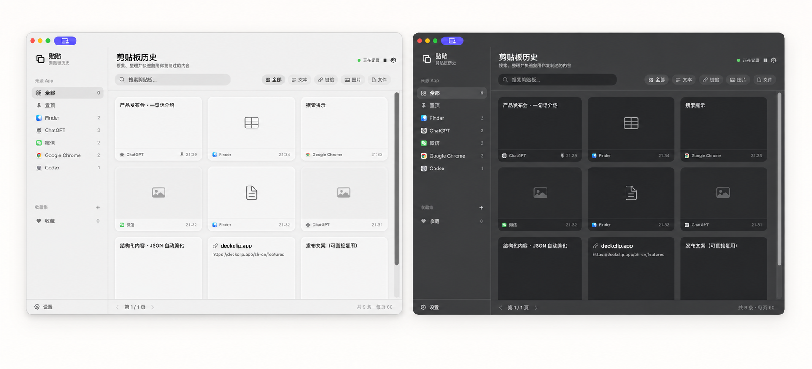

  

<strong>让工作上下文始终在手边。</strong>

  <a href="README.zh-Hans.md">简体中文</a> · <a href="README.md">English</a> · <a href="https://tietie-clipboard.royal-boar-9847.chatgpt.site/">官网</a> · <a href="https://github.com/teeoz/tt-clip/releases">版本发布</a>

贴贴剪切板（英文名 **TT Clip**）是一款本地优先的 macOS 剪贴板历史工具。文字、代码、链接、图片和文件都会留在当前 Mac 上，随时可搜索、预览、重新复制、明确粘贴或拖到下一个应用。

> **公开 Beta Hub**
>
> 本仓库是贴贴剪切板唯一的公开产品入口，用于发布产品介绍、未来已签名 Beta、版本说明与反馈。应用源码不会在此公开。

## 为什么做贴贴剪切板

复制是工作里最频繁、也最容易被打断的动作：一句话、一个链接、一张图、一个文件、一个代码片段或公式，刚刚复制，转眼就需要重新找。贴贴剪切板把这些内容保留在随手可打开的本地历史里，让“**复制 → 找回 → 取用**”成为连续动作。

它适合需要在聊天、浏览器、文档、设计工具、Finder 和代码编辑器之间频繁切换的人。

## 能做什么

| 工作任务 | 贴贴剪切板的处理方式 |
| --- | --- |
| 找回刚才复制过的内容 | 从屏幕边缘打开侧边栏，直接搜索或浏览，不离开当前应用。 |
| 找很久以前的资料 | 在历史库按关键词、内容类型、来源 App、收藏、时间等维度整理。 |
| 在多个应用之间搬运内容 | 重新复制、使用明确的粘贴操作，或把支持的卡片拖到目标应用。 |
| 一次处理多个片段 | 多选后保留顺序，查看并控制连续粘贴队列。 |
| 看清图片、文件、链接或长文本 | 在独立预览中查看大图、OCR、文件信息、网页标题与地址、正文或代码。 |
| 汇集当前任务材料 | 使用置顶、收藏与临时工作区，不会复制出第二条历史记录。 |

## 核心能力

- **侧边栏与快捷键**：可设为左侧或右侧，从屏幕边缘或快捷键快速取回内容。
- **搜索与整理**：支持文本、代码、链接、图片、文件；可按类型、来源 App、时间、置顶、收藏与收藏集筛选。
- **原生预览**：长文本、图片、文件、链接、富文本、代码和 LaTeX 都可在需要时打开独立预览。
- **本地 OCR 与链接工具**：本地识别图片文字；保留网页标题和可区分 URL；仅在用户主动操作时生成二维码或清理可识别链接的追踪参数。
- **双向拖拽**：可将支持的 Finder 内容拖入贴贴，也可把支持的历史内容拖到其他应用。
- **开发者取回**：支持代码语言识别、受限 Swift 本地格式化、编辑器来源锚点，以及用户主动开启的本机 CLI / MCP Bridge。
- **本地优先**：不要求账号；除非用户主动复制、导出、拖拽或分享，否则内容留在这台 Mac。

## 一个典型工作流

1. 在任意 macOS 应用复制内容，贴贴将可读取内容存入本地历史。
2. 通过快捷键或屏幕边缘打开侧边栏。
3. 搜索、筛选、预览、拖拽、重新复制或明确粘贴所需内容。
4. 将当前任务材料加入临时工作区，或收藏以便后续取用。

## 隐私与权限

- 贴贴仅处理你主动复制到系统剪贴板的内容，用于生成可找回的本地历史。
- 辅助功能和输入监控只会在明确需要跨应用自动化的功能里说明并请求；未经 macOS 允许时，不会伪称粘贴已完成。
- 可在“设置 → 隐私与权限”查看状态，并删除单条记录或清理历史。
- 默认不会把剪贴板内容发送到在线服务。

## Beta 状态

未来的公开 Beta DMG 只会在完成 Developer ID 签名与公证后，发布到 [Releases](https://github.com/teeoz/tt-clip/releases)。在此之前，本仓库是唯一官方产品与反馈入口，不会发布未经公证的安装包。

可先阅读[安装与权限指引](docs/INSTALL.md)，了解正式 Beta 上线后的安装流程。

## 参与体验

- 提交可复现的 [Bug](https://github.com/teeoz/tt-clip/issues/new?template=bug_report.yml)。
- 通过[功能建议](https://github.com/teeoz/tt-clip/issues/new?template=feature_request.yml)描述一个希望更顺手的工作流。
- 关注 [Releases](https://github.com/teeoz/tt-clip/releases)，等待公开 Beta。

请不要在公开 Issue 中提交剪贴板正文、私人文件路径、账号、凭据或未打码截图；用中性示例和脱敏诊断报告即可。

## 源码与权利

本公开 Beta Hub 不包含贴贴剪切板的应用源码。产品代码、视觉素材和其他资产均不因本仓库而获得复用许可。
